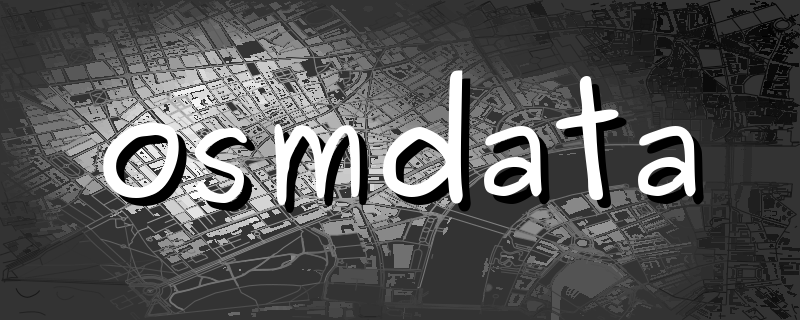

## Introducción a Osmdata

Este tutorial muestra como extraer información de los bancos de un poligono especifico de Bogotá o de todo Bogotá utilizando el paquete   [osmdata](https://github.com/ropensci/osmdata).

Primero instale la última versión del paquete disponible en el CRAN

```{r, eval=FALSE}
install.packages("osmdata")
```

## Consulta

Carga de paquetes adicionales necesarios para la consulta

```{r}
library(tidyverse)
library(osmdata)
library(sf)
library(geojsonsf)
library(mapview)
library(leaflet)
```


OpenStreetMap representa características físicas en el terreno (por ejemplo, carreteras o edificios) mediante etiquetas adjuntas a sus estructuras de datos básicas (sus nodos, caminos y relaciones). Cada etiqueta describe un atributo geográfico de la característica que se muestra en ese nodo, forma o relación específicos. Para mayor información visitar [Map_Features](https://wiki.openstreetmap.org/wiki/Map_Features).

```{r}
head(available_features(), 30)
```

```
 [1] "4wd only"             "abandoned"               "abutters"        "access"              "addr"                   
 [6] "addr:city"            "addr:conscriptionnumber" "addr:country"    "addr:district"       "addr:flats"             
[11] "addr:full"            "addr:hamlet"             "addr:housename"  "addr:housenumber"    "addr:inclusion"         
[16] "addr:interpolation"   "addr:place"              "addr:postcode"   "addr:province"       "addr:state"             
[21] "addr:street"          "addr:subdistrict"        "addr:suburb"     "admin level"         "aeroway"                
[26] "agricultural"         "alt name"                "amenity"         "area"                "atv" 
```

**Amenidad:** Se utiliza para mapear las instalaciones utilizadas por visitantes y residentes. Por ejemplo: baños, teléfonos, bancos, farmacias, cafés, estacionamientos y escuelas. Consulte la página Servicios para obtener una introducción sobre su uso.

```{r}
head(available_tags("amenity"), 24)
```
```
 [1] "animal_boarding"        "animal_shelter"      "arts_centre"       "atm"                   
 [5] "baby_hatch"             "baking_oven"         "bank"              "bar"                   
 [9] "bbq"                    "bench"               "bicycle_parking"   "bicycle_rental"        
[13] "bicycle_repair_station" "biergarten"          "boat_rental"       "boat_sharing"          
[17] "brothel"                "bureau_de_change"    "bus_station"       "cafe"                  
[21] "car_rental"             "car_sharing"         "car_wash"          "casino"
```

### Ejemplo bancos de Bogotá

Primero utilizamos la función `getbb()` para obtener un poligono en forma de cuadrado que sirve como delimitador para el nombre de un lugar determinado.

```{r}
caja <- getbb(place_name = "Bogota", display_name_contains = "Colombia")
caja
```
```
         min       max
x -74.223514 -74.01025
y   4.471175   4.83317
```

Ahora utilizamos la función `opq()` [Over Pass Query](http://overpass-turbo.eu/), que hace un llamado a la API de overpass turbo para extraer la información. Por defecto osmdata se conecta a la siguiente API

```{r}
get_overpass_url()
```

```
[1] "https://overpass-api.de/api/interpreter"
```

Para más información de como utilizar overpass, puede consultar [Overpass API Language Guide](https://wiki.openstreetmap.org/wiki/Overpass_API/Language_Guide).

La funcióm `add_osm_feature` agrega una característica a un query de Overpass y la función `osmdata_sf`, devuelve un query OSM de Overpass query como un objeto osmdata en formato [Simple Features (sf)](https://cran.r-project.org/web/packages/sf/index.html).


```{r}
bank_bog <- opq(bbox = caja, timeout = 25*100) %>% 
  add_osm_feature(key = "amenity", value = "bank") %>% 
  osmdata_sf()
bank_bog
```

```
Object of class 'osmdata' with:
                 $bbox : 4.4711754,-74.2235137,4.8331695,-74.0102483
        $overpass_call : The call submitted to the overpass API
                 $meta : metadata including timestamp and version numbers
           $osm_points : 'sf' Simple Features Collection with 1668 points
            $osm_lines : NULL
         $osm_polygons : 'sf' Simple Features Collection with 227 polygons
       $osm_multilines : NULL
    $osm_multipolygons : NULL
```

Según la documentación de [Open Street Maps ES:Elementos](https://wiki.openstreetmap.org/wiki/ES:Elementos), la cartografía de OpenStreetMap (OSM) contiene 3 tipos de elementos básicos o primitivos:

+ El nodo (node). Los nodos son puntos georreferenciados en una latitud y longitud determinada (un solo punto geospacial).
+ La vía (way). Una línea o vía es una interconexión de al menos dos nodos que representa un elemento lineal como una calle o similar. Los nodos pueden pueden formar parte de varias líneas.
+ La relación (relation). Una relación puede agrupar a otros elementos como nodos y/o vías, así como otras relaciones entre sí.

El primer ejercicio solo mostrara los bancos que fueron mapeados dentro de los poligonos es decir como vías (*ways*), en Bogotá se encuentran solo 227 bancos porlo que hay una subestimación en los registros.

```{r}
mapa1 <- mapview(bank_bog$osm_polygons[,c("osm_id","name","amenity","atm","operator")])
leaflet(mapa1@object[[1]]) %>% addProviderTiles("OpenStreetMap") %>% addPolygons(popup = bank_bog$osm_polygons$name)
```


En el segundo ejercicio se mapean los puntos es decir los nodos (*node*), sin embargo ocurren dos problemas.
El primero los puntos están duplicando la información ya que para los bancos mapeados como polignos, se representara cada esquina del poligono como un punto, por está razón hacemos un filtro donde *amenity* sea igual a *bank*, con lo cual traemos 623 bancos.

```{r}
mapa2 <- mapview(subset(bank_bog$osm_points[,c("osm_id","name","amenity","atm")], amenity == "bank"))
leaflet(mapa2@object[[1]]) %>% addProviderTiles("OpenStreetMap") %>% addCircles(popup = bank_bog$osm_points$name)
```


Para traer la totalidad de los bancos debemos unir la información extraída vía nodes y ways. A continuación se muestra el código. Para poder unir la información debemos transformar los polígonos en puntos para eso, hallamos el centroide de cada polígono con la función `st_centroid` y la unimos con `bind_rows`.

```{r}
res_node <- subset(bank_bog$osm_points[,c("osm_id","name","amenity","atm")], amenity == "bank")
res_way <- mutate(bank_bog$osm_polygons[,c("osm_id","name","amenity","atm","operator")], name = ifelse(is.na(name), operator, name)) %>% 
  select(-"operator") %>% mutate(geometry = st_centroid(geometry), id = osm_id) %>% remove_rownames %>% column_to_rownames(var = "id")

res_bank <- bind_rows(res_node, res_way)
res_bank
```
```
Simple feature collection with 850 features and 4 fields
geometry type:  POINT
dimension:      XY
bbox:           xmin: -74.22071 ymin: 4.531904 xmax: -74.02355 ymax: 4.810972
geographic CRS: WGS 84
First 10 features:
             osm_id             name amenity  atm                   geometry
292776528 292776528       Davivienda    bank <NA>  POINT (-74.13741 4.63605)
327451320 327451320       Davivienda    bank  yes POINT (-74.08347 4.630389)
369320464 369320464      Bancolombia    bank  yes   POINT (-74.05661 4.6704)
369320535 369320535       Davivienda    bank  yes POINT (-74.05619 4.669895)
369321132 369321132        AV Villas    bank  yes POINT (-74.05177 4.666699)
374448489 374448489             BBVA    bank  yes POINT (-74.04464 4.733994)
385176594 385176594             <NA>    bank <NA> POINT (-74.07138 4.605569)
385626411 385626411 Banco de Bogotá    bank  yes POINT (-74.04864 4.682842)
392342509 392342509       Davivienda    bank  yes POINT (-74.04639 4.749124)
401423492 401423492 Banco de Bogotá    bank <NA> POINT (-74.05795 4.658711)
```

Tenemos un total de 850 bancos en Bogota. Y graficamos los puntos.

```{r}
mapa3 <- mapview(res_bank)
leaflet(mapa3@object[[1]]) %>% addProviderTiles("OpenStreetMap") %>% addCircles(popup = res_bank$name)
```
